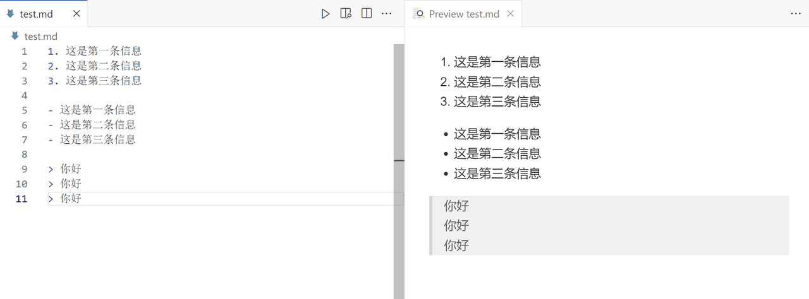
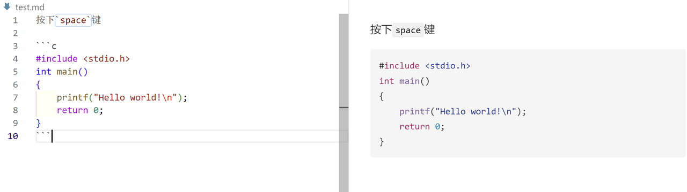
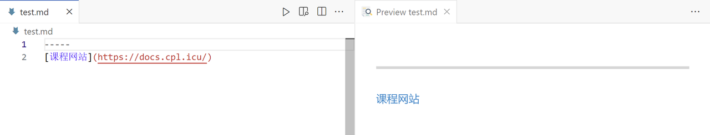
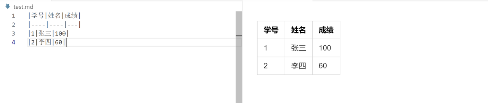

# Markdown的基础语法
---
## 标题格式
1. `#`+`空格`+`文字`,而文字的大小由#的数量决定
2. 另起一行===或---

## 正文
1. 正常格式：不需要加任何其他符号
2. 斜体字：*xxx* 或_xxx_
3. 加粗字：**xxx**或__xxx__
4. 加粗斜体：***xxx*** 或___xxx___
5. 删除线：~~ xxx ~~
6. 高亮：==xx==

## 列表
1. 有序列表：`阿拉伯数字`+`.`+`空格`+`文字`
2. 无序列表：`-`+`空格`+`文字`(使用`*`或`+`也可以)

## 块引用
格式：`>`+`空格`+`文字`，可以写多行内容，放在同一个块中。


## 代码
1. 行内代码：使用反引号`：`+代码+`
2. 多行代码块：使用三个反引号包裹代码```，并可指定语言（在一开始的```后写上你所指定的语言）


## 链接
[+链接文本+]+(+链接地址+)


## 分割线
使用三个及以上的 -、* 或 _ 创建分割线。

## 表格
使用 | 和 - 创建表格。例如：
在第二行必须要有形如|---|----|---|的内容，从而划分列数。每一格中-的数量是不作要求的。


---
## LaTex
### 一、函数、符号及特殊字符
1. 向量：$\vec{a}+\vec{b}$
#### 标准函数
- 指数：$\exp_a b = a^b, \exp b = e^b,10^m$
- 对数：$\ln c, \lg d = \log e, \log_{10} f$
- 三角函数：
  - $$\sin a, \cos b, \tan c, \cot d, \sec e, \csc f$$
  - $$\arcsin a, \sinh a$$
- 绝对值：$\left\vert s \right\vert $
- 最大值、最小值：$\min(x,y), \max(x,y)$
#### 界限，极限
- $$\min x, \max y$$
- $$\lim u$$
- $$\lim_{x \to \infty} \frac{1}{n(n+1)}$$
#### 投射
- $$\Pr j_a\vec{r}$$