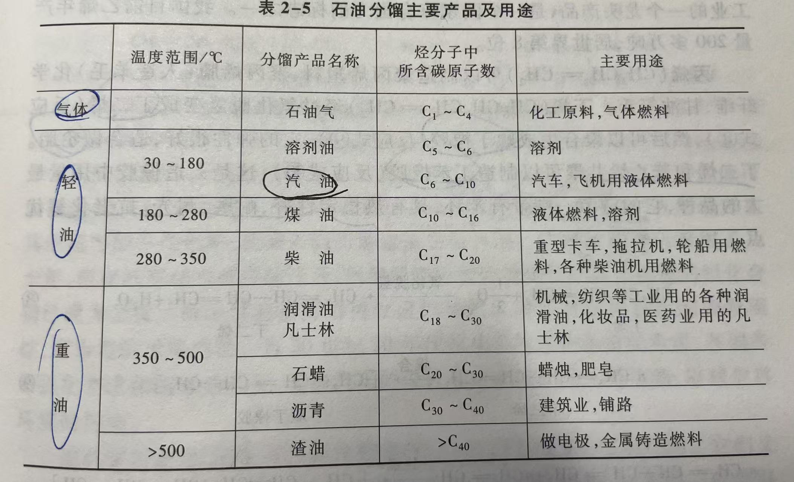
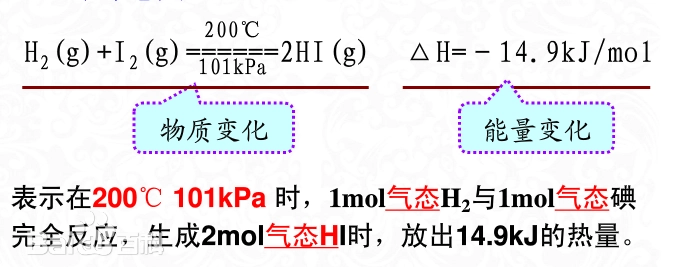

# 化学与社会
---
## 一、物质结构基础部分
>  对应教材U1原子结构和元素周期律、U3化学键

### （一）核外电子运动状态
1. **四个量子数（n,l,m,ms）的取值及物理意义**

    **主量子数n**：对应电子层K,L,M,N,O,P
      - 表示核外电子层数
      - n值越大，电子离核越远，==能量越高==
      - 得出结论：能量是量子化的

    **角量子数l**：决定原子轨道或者电子云的形状，对应s,p,d,f
     -  表示电子亚层，确定原子轨道的形状
     -  n相同时，l越大，电子能量越高

    **磁量子数m**：数值可取0，正负1，2，……l
     -  规定电子运动状态在==空间延展的取向==

    **自旋量子数ms**：取值位正负1/2
      - 表示一个轨道中电子有两种不同的自旋方向
 - 核外电子的运动状态由四个量子数共同确定，其中n，l，m三个确定电子所在的轨道，ms表自旋状态
 
2. **核外电子排布**
   服从以下规则：
      - 泡利不相容原理：在一个原子轨道上最多排两个电子，且自旋方向相反
      - 能量最低原理：电子优先占据能量较低的原子轨道，是整个原子体系能量处于最低，这样的状态是原子的基态（能级交错）
      - 洪特规则：在能量相等的轨道上，自选平行的电子数目最多时原子能量最低（全充满、半充满或者全空比较稳定）

3. **元素周期表前36号元素的电子排布式**

### （二）元素周期律
1. **元素周期表的构成**
  -  7个周期：每周期元素个数 = 相应能级组原子轨道所能容纳的电子数。
  -  16个族：7个主族，7个副族，一个第八族，一个零族
2. **周期表的分区**
    按照元素外围电子构型不同，分为s、p、d、ds、f五个区。
3. **原子半径的变化规律**
    同一周期中：从左到右减小
    同一族中，从上到下增加
    （副族元素变化规律性不明显）
4. **电离能（*I*）的意义及变化规律**
  - **（第一电离能）意义**：气态原子失去一个电子成为一价气态正离子所诉吸收的能量
  - **变化规律**
        周期：从左到右第一电离能一般增加。（存在波动）
        族：自上而下减小
        （副族不明显）
5. **电负性的意义及变化规律**
  - **意义**：用以量度分子中原子对成键电子吸引能力的相对大小
  - **变化规律**：
      - 周期：从左到右增加
        族：自上而下下降
        电负性最大的元素：**F**
        最小：**Cs**

### （三）化学键
1. **离子键**
 -   基本概念：正负离子之间强烈的静电作用力，无方向性和饱和性，强度用晶格能表示
 -   晶格能的大小与离子电荷的数量（正比）和离子半径（反比）有关
2. **共价键**
  - 基本概念：通过共用电子对形成的原子间作用力，具有方向性和饱和性。
  - ==杂化轨道理论==：三种等性杂化轨道杂化的意义及相应分子的空间构型
  - ==等性杂化与不等性杂化==：CH4 属于等性杂化，而NH3 和H2O 分子都属于不等性sp3杂化。
  - 极性分子：正负电荷中心不重合&非极性分子
  - 极性共价键：由电负性不同的两个原子形成的共价键（键的机型是一种矢量）
  - 共价键的分类：
    - σ键：头碰头，重叠程度大，较稳定
    - π键：重叠程度小，较活泼
3. **配位键**
  - 定义：由一个原子提供电子对，另一个原子提供空轨道，形成的共价键
  - 组成：
      - **中心离子**：是配位化合物中能够接受孤对电子或不定域电子的离子或原子，位于配位单元的几何中心，也称为配合物的形成体。
      - **[氧化数](+https://zh.wikipedia.org/wiki/%E6%B0%A7%E5%8C%96%E6%95%B0+)**：用来表示化合物中，所有配体及电子对都被去掉后，中心原子所带的电荷数。该荷电数是假定把每一化学键中的电子指定给电负性更大的原子而求得的。
      - **配位体**：是能提供电子对与配位化合物中的中心元素相结合的阴离子或中性分子，如含有孤对电子的卤素元素、氨等。
      - **配位数**：指配位化合物中中心金属离子周围与其形成化学键的配体的数量。
      - **内界**：由中心离子（或原子）和配位体组成，它们之间靠配位键结合。一般把内界写在方括号[ ]以内。
      - **外界**：指配位化合物中除了內界以外的其他部分，通常是简单的离子。在配位化合物中，內界与外界之间以离子键相结合。
4. **金属键**
    金属中自由电子和金属离子之间的作用力称为金属键。金属键没有方向性、没有饱和性。
5. **分子间力**
   - 非极性分子间：色散力
   - 极性分子和非极性分子之间：色散力、诱导力
   - 极性分子之间：色散力、诱导力、取向力。色散力是主要的，存在于一切分子之间，其强度随分子量的增大而增大。
   - **氢键**的形成条发生在含有氢原子的分子与具有较强电负性的原子之间（N、O和F）
6. **四种基本的晶体类型**
   |    |晶格节点粒子|粒子间作用力|熔沸点|相对硬度|熔融导电性|eg：|
   |---|---|---|---|---|---|---|
   |离子晶体|离子|离子键|高|大|好|NaCl|
    |原子晶体|原子|共价键|高|大|差|金刚石|
    |金属晶体|原子、离子|金属键|高低|大小|好|K|
    |分子晶体|分子|分子间力|低|小|差|干冰|

---

## 二、能源部分
> 对应教材U2能源
1. **能源**
   - **来源**：
     - 来自地球以外的太阳能：包括煤炭石油天然气风能等间接来自太阳能的能源
     - 来自地球本身：如地热能，原子核能
     - 由天体对地球引力产生的能量：如潮汐能
   - **分类方法**
     - 一次能源：自然界县城存在，可以直接取得且不必改变其基本形态的能源
         -  常规：可再生（水能）&不可再生（煤炭石油天然气）
          - 新能源：可再生（太阳能风能）&不可再生（核聚变燃料）
      -  二次能源：由一次能源经过加工或转换成另一种形态的能源产品
         - 煤制品
         - 石油制品
         - 电力、氢能、余热、沼气等
2. **煤炭**（2.2碳的化学 2.5催化作用今年不考）
    - 在我国能源消费结构中占据==首要==（70%）地位
    - 煤炭的综合利用技术
       - **气化**：让煤在氧气不足的情况下进行部分氧化，，使煤中的有机物转化为可燃气体
       - **焦化（干馏）**：把煤置于隔绝空气的密闭炼焦炉内加热，分解生成固态的焦炭、液化的煤焦油、气态的焦炉气
       - **液化**：煤加热裂解→大分子变小→催化剂作用下加氢→得到多种燃料油
3. **石油**
   - 元素组成：主要是C,H,还有O,N,S
   - 炼制方法：
     - **分馏**：将石油中几种不同沸点的混合物分离的一种方法。先常压获得低沸点馏分，再减压状况下获得高沸点馏分。石油产品包含粗石油、轻油、煤油及重油等
       - 分馏各馏分与温度的关系
        
        - 汽油“辛烷值”：评价汽油质量的指标，而抗震性能最好的是异辛烷（100），最差的是正庚烷（0）。若汽油辛烷值位85，则表明是由85%异辛烷和15%正庚烷组成，为85号汽油
     -  **裂化**：采用催化裂化法获得大量分子量小的各种烃类
     - **催化重整**：在一定温度压力下，汽油中的直链烃再催化剂表面上进行结构的“重新调整”，转化为带支链的烷烃异构体，能有效地提高汽油的辛烷值，获得一部分芳香烃。
     - **加氢精制**：是提高油品质量的过程。现在的办法是使用催化剂在一定温度和压力下使氢气和杂环有机物其反应生成氨气或硫化氢而分离。
4. **核**
   - 核反应：
     - 核衰变：U,Po,Ra等这类原子核不稳定，能自发地发出辐射变成另一种原子核。α衰变（偏向负极，带正电的α粒子），β衰变（带负电的β粒子流），γ衰变（短波光子流，不带电不偏移）
     - 核裂变：指由重的原子核（主要是指U核或钚核）分裂成两个或多个质量较小的原子的一种核反应形式，形成链式反应。
     - 核聚变：两个较轻的核结合而形成一个较重的核和一个极轻的核（或粒子）的一种核反应形式
   - 核能：通过核反应从原子核释放的能量
   - 核安全问题：一是核电站的安全运行问题，二是核废料的处理。
5. **新能源**
   - 形式：太阳能，生物能，风能，地热能，海洋能。
6. **能源焦点问题**
   - **氢能**
     - 绿氢：是可再生能源（如风电、水电、太阳能）等制氢，制氢过程完全没有碳排放
     - 蓝氢：使用石化燃料制氢，同时使用碳捕集和碳封存，比灰氢更清洁
     - 灰氢：石化燃料制氢，会释放出大量的二氧化碳。
     - 粉氢：利用核能发电，将水电解为氢气和氧气制备而成。可以视为低碳氢，但可持续性取决于核能发电和废物处理的方法。
   - **氢燃料电池**：是将氢气和氧气的化学能直接转换成电能的发电装置。其基本原理是电解水的逆反应，把氢和氧分别供给阳极和阴极，氢通过阳极向外扩散和电解质发生反应后，放出电子通过外部的负载到达阴极。
   - **“人造太阳”**：模仿太阳的工作原理（核聚变），本质上是探究如何可控核聚变
   - **可燃冰及其开采**
7. **判断社会上一些不符合科学规律的炒作**
8. **熟悉热化学方程式的意义和计算**
    

---

### （三）环境污染与保护部分
> - 对应教材U4环境与环境污染和U5化学与环境保护
> - 4.1环境与生态平衡、4.2自然环境中化学物质的循环今年不考