# 第五章 构建程序（Python）
## 二、程序中的数据表示
### 数据的表现形式
1. 常量：代码中固定值的表示方法
   - 整数、浮点数、字符串（str）、布尔值
   - 在IDLE的shell方式下用`type()`函数检测数据的类型
2. 变量
   - 变量名 = 值（其实是给一个地址取一个名字）
   - **变量名**（标识符）：不能以数字开头（下划线可以）、区分大小写、关键字禁止
   - **标识符**还可以表示函数名、类名
3. 运算符和表达式
   - 注意区分关系运算符（==）和赋值运算符（=）啊！！！
   - 算术/比较（关系）/逻辑（and、or、not）/赋值运算木
     - **注意区分**：'/'指两数之商，'//'是向下取整的两数之商，'%'是两数之商的余数
> 1. 从键盘上获取数据：`input()`函数
> 格式：`<变量> = input(<可选的提示性文字>)`
> 默认接受的数据类型为字符串类型，但可以进行类型转换
> 如：`a = float(input(“请输入一个小数”))`(注：这里的`input()`函数和C里面的`scanf()`不同，不需要输入占位符)
> `>>>type(a)`
> `>>><class 'float'>`
> 2. `eval()`函数：用来**将字符串当成有效的表达式来求值，并返回计算结果**（就是讲字符串当代码执行），返回表达式的值并**识别计算结果的数据类型**
> 3. `print()`函数：和C差不多，需要双引号，每次输出后默认回车换行
>    - 可以制定end参数的取值来去取消回车换行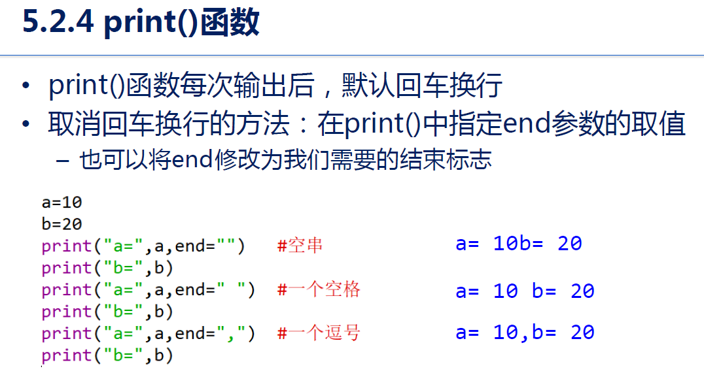

## 三、程序的控制方法
1. 顺序结构
2. 分支结构
```   
    if <条件>:
        <语句块1>
    elif<条件2>:
        <语句块2>
    else:
        <语句块3>
```
3. 循环结构：
   - for循环使用**遍历的方式将序列结构中的元素全部访问一边
   - while循环：程序员自己设定条件控制循环运行
```
for <循环变量> in <序列结构>:
    <语句块>
```
**(注意冒号、range是左闭右开口牙！！！)**
> 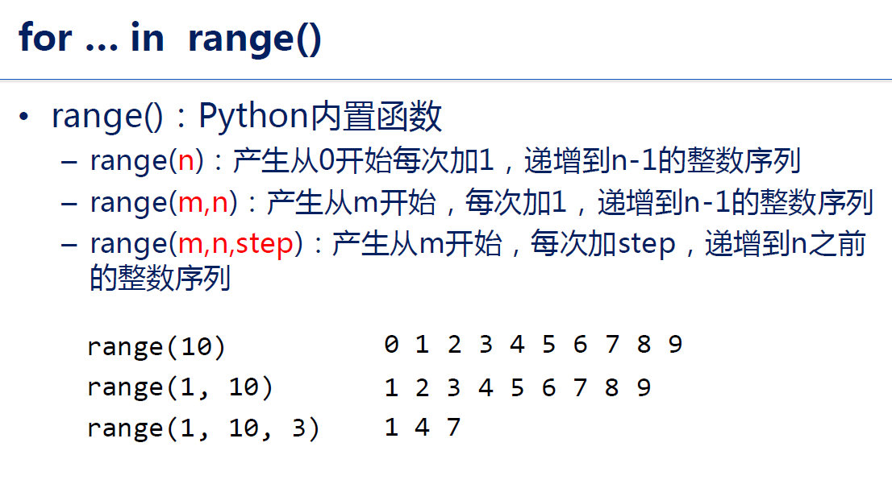

# 第六章 问题求解
## 一、数据类型的概念
> 数据类型：数据在计算机中的存储、表示规范
1. **序列**：方括号括起、逗号分隔的一组值(注意是从0开始编号！)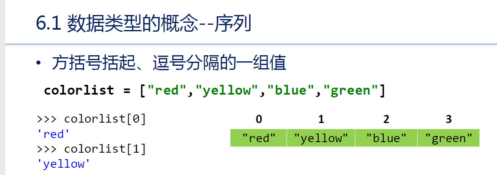
   - 字符串(string)：双引号、单引号、三引号
   - 列表(list)：方括号（可以通过`list()`函数进行包装，当多个数据并且需要同时存在的时候使用列表
   - 元组(tuple)：圆括号
2. **序列类型的操作**
   - **索引**：访问特定类型的元素，从**start开始**到索引**end之前结束**，可以正向索引和反向缩影
   - ```
        列表名[start:end]```
    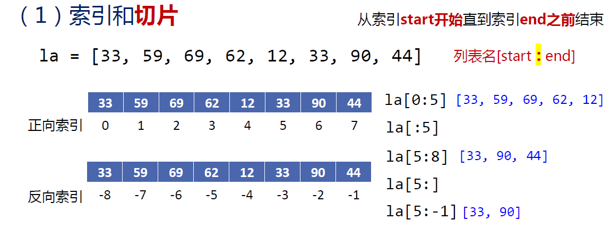
   - **切片**：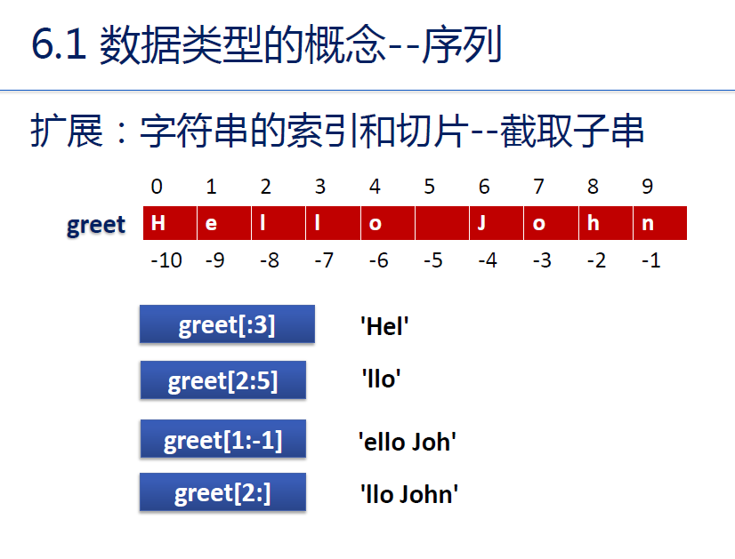
   - **in/not in , * , +**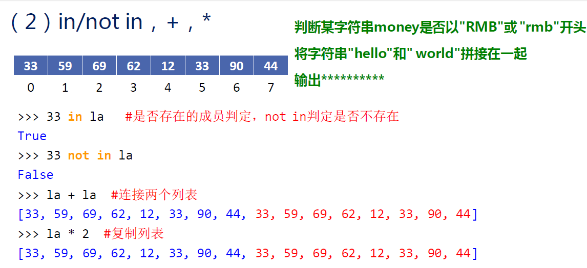
   - **`len() min() max()`**：这个算函数(function)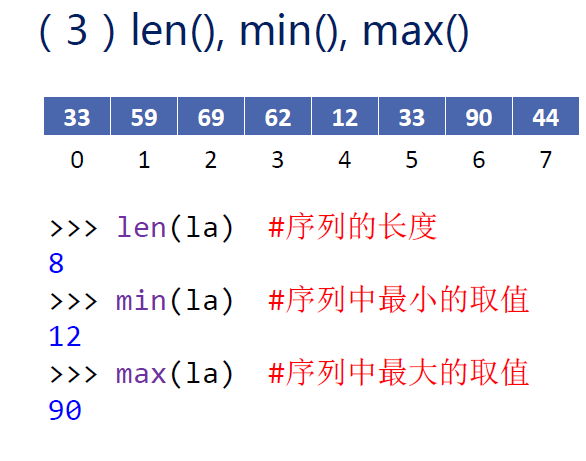
   - **`.count() .index()`**：这个算方法(method——格式：`字符串对象.方法(参数)`)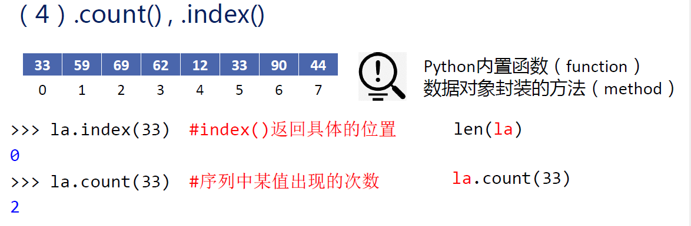
3. **集合**：可以存放多个、**类型任意**的数据，**不会重复出现某个元素**
   - 使用大括号{}，用`set()`函数包装字符串、列表等
   - ```python
        >>> alpha = set("abcdef") #字符串->集合
        >>> alpha
        {'a', 'e', 'b', 'd', 'f', 'c'}
        ```
   - 利用集合的“元素唯一性”特点，可以对序列**快速去重**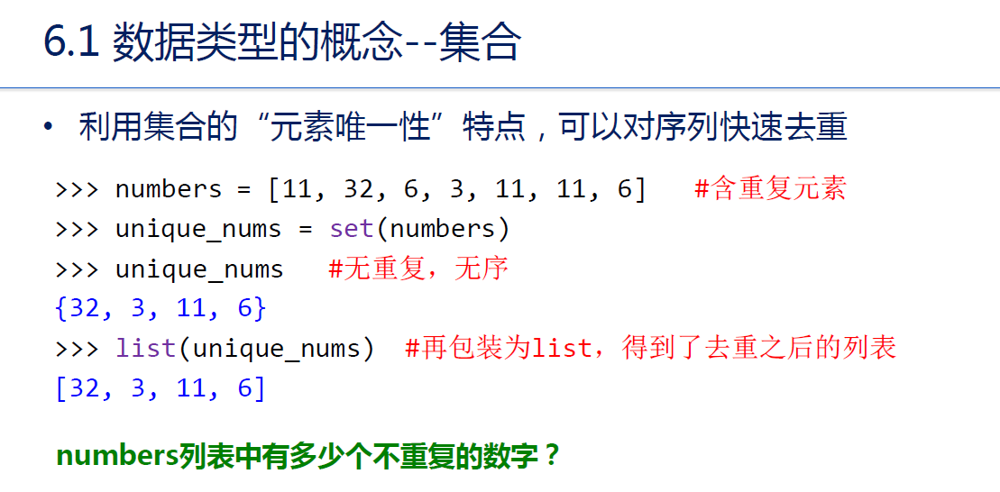
4. **字典**：是一种映射类型，数据以**键值对**<key, value>形式出现，key为“键”，value为“值”
   - 字面形式：外侧一对大括号{}，键值对之间用逗号分开
   - 访问字典元素：使用方括号并在括号里放入键，可以**读取、插入新值、修改已有值**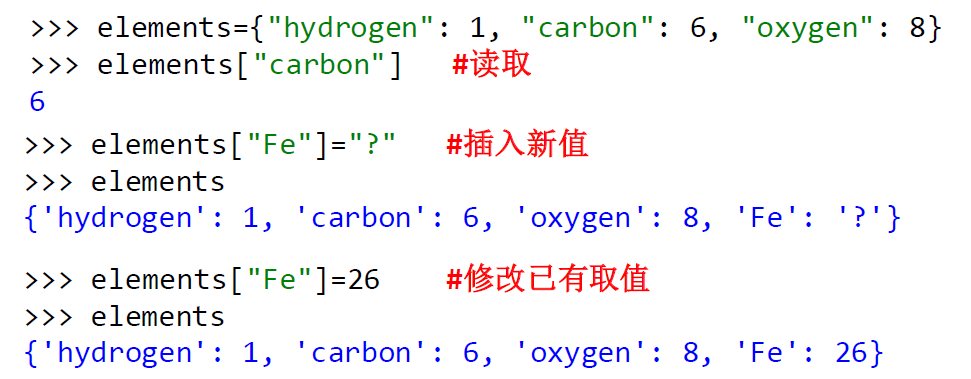而键不存在的情况会报错

## 二、常见的文本操作（均为方法）
1. **查找**：查找子串出现的位置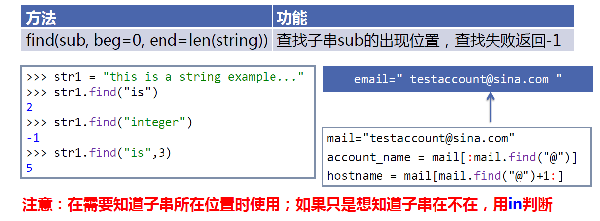
2. **替换**`.replace(old,new)`：产生新的字符串，原字符串不变，需要通过赋值运算将新字符串保存下来
3. **计数**`.count(sub,begin=0,end=len(string))`：统计指定字符串sub出现的次数
4. **分割**：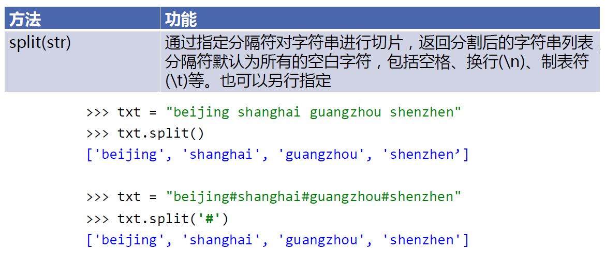
5. **连接**：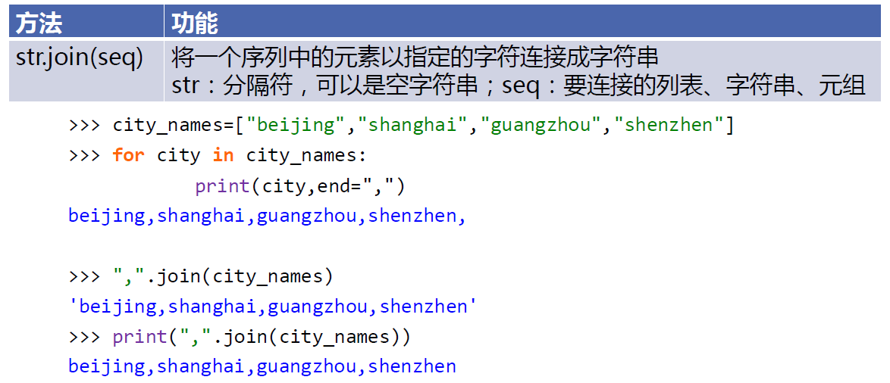